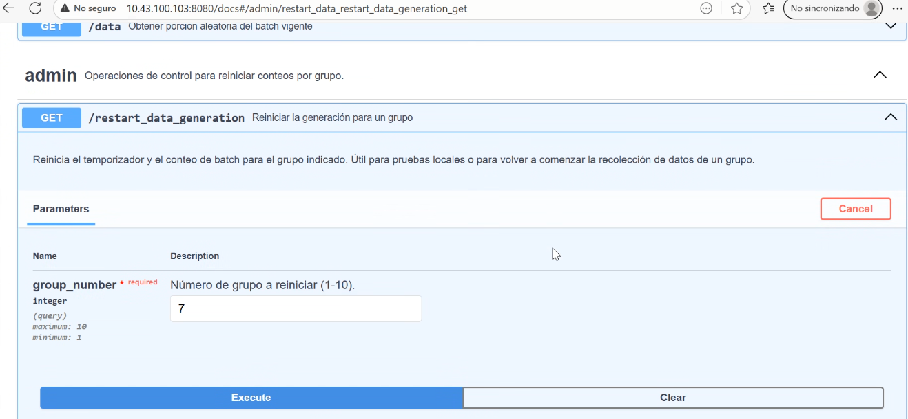
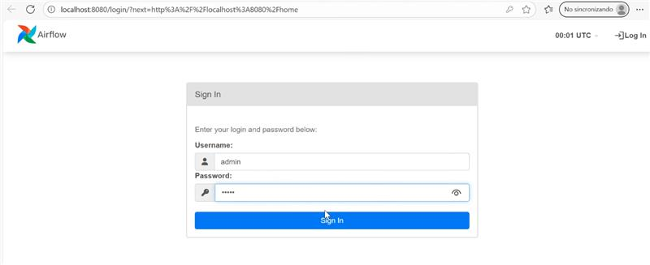
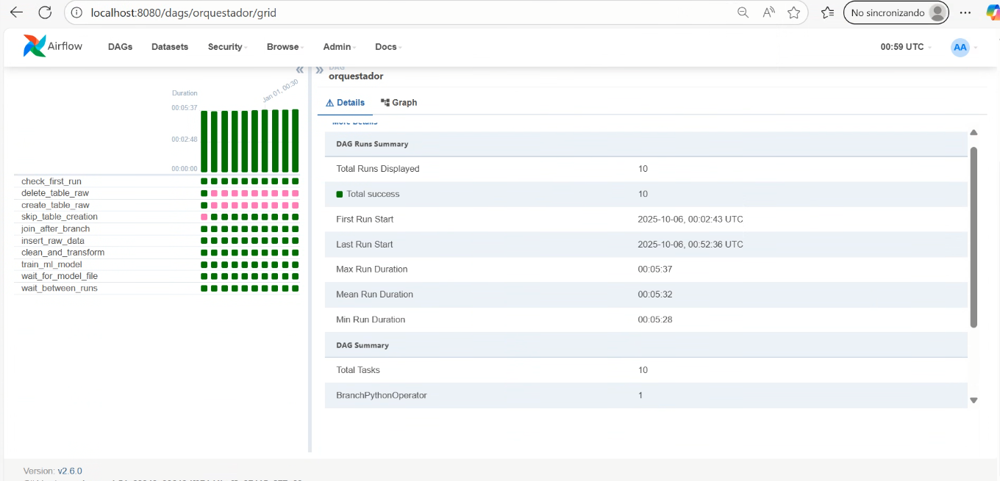

# MLOps Proyecto 2 

**Grupo:** Sebastián Rodríguez y David Córdova  
**Curso:** Machine Learning Operations (MLOps)  
**Profesor:** Cristian Diaz Alvarez

Este proyecto implementa un pipeline completo de Machine Learning Operations (MLOps) que automatiza desde la limpieza de datos hasta el entrenamiento de modelos y despliegue de API, utilizando Apache Airflow como orquestador principal.

---

##  Descripción General

Este proyecto implementa un **pipeline completo de MLOps** que automatiza el proceso de:
1. Recolección de datos desde una **API externa** (http://10.43.100.103:8080)
2. Limpieza, almacenamiento y transformación con **Apache Airflow**
3. Entrenamiento automático de modelos con **scikit-learn**
4. Registro y seguimiento de experimentos en **MLflow**
5. Despliegue de modelo en una **API FastAPI**
6. Exposición del modelo entrenado como servicio REST para realizar predicciones en tiempo real

---

## Características Principales

- **Orquestación automática** del pipeline mediante **Airflow**
- **Contenerización total** con **Docker Compose**
- **Auto-disparo del DAG** al iniciar los contenedores
- **Recolección dinámica** de datos desde la API del profesor (nuevos datos cada 5 min)
- **Entrenamiento reproducible** y versionado de modelos con MLflow
- **Servicio FastAPI** que permite consumir el modelo para predicciones
- **Volúmenes compartidos** entre Airflow y FastAPI para acceso a modelos `.pkl` y columnas `.json`

---

## Estructura del Proyecto

```
MLOps_Proyecto2/
├── dags/
│ ├── fastapi.log
│ ├── fastapi_ready.txt
│ ├── models/
│ ├── orquestador.py
│ ├── pycache/
│ └── scripts/
│ ├── funciones.py
│ └── queries.py
├── docker-compose.yaml
├── fastapi/
│ ├── Dockerfile
│ ├── main.py
│ ├── models/
│ ├── pycache/
│ └── requirements.txt
├── images/
│ ├── compose.jpg
│ ├── dag.jpg
│ ├── fastapi.jpg
│ ├── fastapi_prediction.jpg
│ ├── login.jpg
│ └── orquesta.jpg
├── logs/
│ ├── dag_id=dag_mysql_demo/
│ ├── dag_id=mysql_insert_select/
│ ├── dag_id=orquestador/
│ ├── dag_processor_manager/
│ └── scheduler/
├── minio/
├── mlflow/
├── models/
│ └── LogisticRegression.pkl
├── plugins/
├── README.md
└── venv/
├── bin/
├── include/
├── lib/
├── lib64 -> lib
└── pyvenv.cfg
```

---


## Descripción de Componentes


### Componentes Principales

###  Airflow
- **`dags/orquestador.py`**: DAG principal que orquesta todo el flujo:
  - Llama a la API externa para recolectar datos (http://10.43.100.103:8080)
  - Procesa y limpia los datos
  - Entrena el modelo de IA
  - Guarda los resultados en `/opt/airflow/models`
  - Señaliza a FastAPI que el modelo está listo (`fastapi_ready.txt`)
  
- **`dags/scripts/funciones.py`**:
  Contiene las funciones:
  - `fetch_data_from_api()`: obtiene datos del endpoint del profesor
  - `clean_data()`: preprocesa la información
  - `train_model()`: entrena y guarda el modelo + columnas en JSON
  - `start_fastapi_server()`: activa FastAPI una vez el modelo está disponible
---

###  FastAPI
- **`fastapi/main.py`**:
  Expone el modelo entrenado como API REST (`/predict`)
  para recibir un JSON con las mismas columnas del entrenamiento.


  Ejemplo de entrada:

```json
{
  "Elevation": 3000,
  "Aspect": 45,
  "Slope": 10,
  "Horizontal_Distance_To_Hydrology": 150,
  "Vertical_Distance_To_Hydrology": 20,
  "Horizontal_Distance_To_Roadways": 200,
  "Hillshade_9am": 220,
  "Hillshade_Noon": 250,
  "Hillshade_3pm": 180,
  "Horizontal_Distance_To_Fire_Points": 500,
  "Wilderness_Area_Commanche": 0,
  "Wilderness_Area_Neota": 0,
  "Wilderness_Area_Rawah": 1,
  "Soil_Type_C2705": 0,
  "Soil_Type_C4703": 0,
  "Soil_Type_C4704": 0,
  "Soil_Type_C4758": 0,
  "Soil_Type_C6101": 0,
  "Soil_Type_C6102": 0,
  "Soil_Type_C7101": 0,
  "Soil_Type_C7103": 0,
  "Soil_Type_C7201": 0,
  "Soil_Type_C7202": 0,
  "Soil_Type_C7700": 0,
  "Soil_Type_C7702": 0,
  "Soil_Type_C7746": 1,
  "Soil_Type_C7755": 0,
  "Soil_Type_C7756": 0,
  "Soil_Type_C7757": 0,
  "Soil_Type_C7790": 0,
  "Soil_Type_C8703": 0,
  "Soil_Type_C8771": 0,
  "Soil_Type_C8772": 0,
  "Soil_Type_C8776": 0
}
``` 
  
----


### Resumen del flujo

```
check_first_run_task
         ↓
 ┌───────────────────────────┐
 │                           │
 ↓                           ↓
delete_table_raw         skip_table_creation
         ↓                      ↓
         └──────── join_after_branch ────────┘
                             ↓
                     insert_raw_data
                             ↓
                    clean_and_transform
                             ↓
                        train_ml_model
                             ↓
                        wait_for_model
                             ↓
                       wait_between_runs
```


**Resultado final:**  
Se obtiene un modelo de clasificación entrenado y validado automáticamente, listo para ser consumido desde FastAPI.


## Instrucciones de Ejecución

### Preparación Inicial

```bash
# Clonar el repositorio
git clone https://github.com/spartron12/MLOps_proyecto2.git
cd MLOps_proyecto2

# Limpiar entorno previo (si existe)
docker compose down -v
docker system prune -af
```

### Ejecución Completamente Automática (Recomendado)

```bash
# Después de la preparación inicial, simplemente:
docker compose up
```

**Qué sucede automáticamente:**
- Se crean todos los contenedores necesarios (Airflow, MySQL, MLflow y FastAPI).
- Airflow inicia automáticamente con credenciales admin/admin.
- El DAG orquestador se activa automáticamente al iniciar los contenedores.
- El pipeline ejecuta 10 ejecuciones programadas cada 5 minutos, en las cuales:
  - Se cargan y limpian los datos.
  - Se entrena un nuevo modelo de Regresión Logística en cada iteración.
  - Cada modelo se guarda en la ruta: /opt/airflow/models/LogisticRegression.pkl
  - Los modelos, métricas y parámetros se registran en MLflow bajo el experimento proyecto_airflow.
- Al finalizar las 10 corridas, FastAPI queda disponible con el modelo final entrenado para realizar predicciones.


### Ejecución en Background

```bash
# Para ejecutar en segundo plano
docker compose up -d

# Ver logs en tiempo real
docker compose logs -f dag-auto-trigger
```

### Verificación Manual del Estado

```bash
# Verificar que Airflow esté disponible
curl -f http://localhost:8080/health

# Verificar estado de contenedores
docker compose ps

# Acceder a la interfaz web
# http://localhost:8080 (admin/admin)
```

## Acceso a Servicios

| Servicio | URL | Credenciales | Descripción |
|----------|-----|--------------|-------------|
| **Airflow Web** | http://localhost:8080 | admin/admin | Dashboard del pipeline |
| **FastAPI Docs** | http://localhost:8000/docs | - | API de predicciones |
| **MySQL** | localhost:3306 | my_app_user/my_app_pass | Base de datos |
| **Flower (opcional)** | http://localhost:5555 | - | Monitor de Celery |

## Ejecución del Proyecto

### 1. Reinicio del contador de ejecución batch


### 2. Login de Airflow


### 3. Ejecución Automática del Pipeline - DAG Auto-Activo


## 4. Visualización todos los tasks de Airflow ejecutándose automaticamente


## 5. Visualización de los fetures de la ejecución de airflow


## 6. Evidencia de los logs de ejecución en mlflow


## 7. Inferencia en FastAPI


## Funciones Técnicas Implementadas

### funciones.py - Lógica del Pipeline

```python
def insert_data():
    """Inserta datos de forest en MySQL"""
    # Carga dataset forest
    # Limpia valores nulos y NaN
    # Inserta registros en tabla MySQL `forest_raw`

def clean(df):
    """Limpia y transforma los datos"""
    # Elimina registros con valores nulos
    # Aplica One-Hot Encoding para variables categóricas ('Wilderness_Area', 'Soil_Type')
    # Retorna DataFrame listo para almacenar en `penguins_clean`

def read_data():
    """Lee y procesa datos desde MySQL"""
    # Extrae registros desde tabla `penguins_raw`
    # Aplica limpieza y codificación con `clean()`
    # Inserta datos transformados en tabla `penguins_clean`
def create_dynamic_table():
    """Crea tabla dinámica basada en las columnas del DataFrame"""
    # Una vez se limpian los datos, se crea la tabla en función de las columnas que generen el onehot
    #crea tabla `forest_clean`
def insert_data_dynamic():
    """Inserta datos de forma dinámica"""
    # Se insertan los datos en función de la tabla anteriormente creada
    #

def train_model():
    """Entrena y guarda un modelo de Regresión Logística"""
    # Carga datos desde tabla `forest_clean`
    # Divide dataset en entrenamiento y prueba
    # Entrena modelo de clasificación
    # Evalúa desempeño con métricas (accuracy)
    # Guarda los logs experimentales en mlflow
    # Guarda modelo en `/opt/airflow/models/RegresionLogistica.pkl`

def check_table_exists():
    """verifica si la tabla forest_raw existe"""
    # Verifica existencia de las tablas inciales con el fin de evaluar que paso ejecutar, si crear las tablas o pasar a la inserción
 

```

### queries.py - Consultas SQL

```sql
DROP_TABLE = """
DROP TABLE IF EXISTS forest_raw;
"""

CREATE_TABLE_RAW = """ CREATE TABLE IF NOT EXISTS forest_raw (
            Elevation INT NULL,
            Aspect INT NULL,
            Slope INT NULL,
            Horizontal_Distance_To_Hydrology INT NULL,
            Vertical_Distance_To_Hydrology INT NULL,
            Horizontal_Distance_To_Roadways INT NULL,
            Hillshade_9am INT NULL,
            Hillshade_Noon INT NULL,
            Hillshade_3pm INT NULL,
            Horizontal_Distance_To_Fire_Points INT NULL,
            Wilderness_Area VARCHAR(50) NULL,
            Soil_Type VARCHAR(50) NULL,
            Cover_Type INT NULL
        )
        """

```


## Conclusiones

- Se logró automatizar de extremo a extremo el flujo de trabajo de ML, reduciendo la necesidad de intervención manual.
- El uso de Apache Airflow como orquestador central permitió programar, coordinar y asegurar la correcta ejecución de todas las etapas del pipeline.
- La contenerización con Docker Compose garantizó portabilidad, replicabilidad y facilidad de despliegue en diferentes entornos.
- El pipeline incorpora versionamiento y trazabilidad a través de MLflow, lo que facilita la comparación entre experimentos y modelos entrenados.
- La integración con FastAPI asegura un servicio REST confiable para predicciones en tiempo real, conectando directamente el resultado del pipeline con aplicaciones   externas.
- La arquitectura desarrollada permite escalabilidad y mantenibilidad, ofreciendo una base sólida para llevar modelos de ML a producción.

- En conclusión, el proyecto representa un ejemplo práctico y funcional de cómo aplicar principios de MLOps en un entorno real, logrando un sistema reproducible, confiable y eficiente para la gestión del ciclo de vida de modelos de Machine Learning.
---

**Desarrollado por:**
- Sebastian Rodríguez  
- David Córdova

**Proyecto:** MLOps Proyecto 2 - Pipeline Automatizado  
**Fecha:** Octubre 2025
